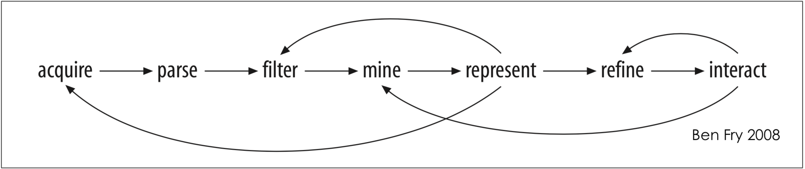
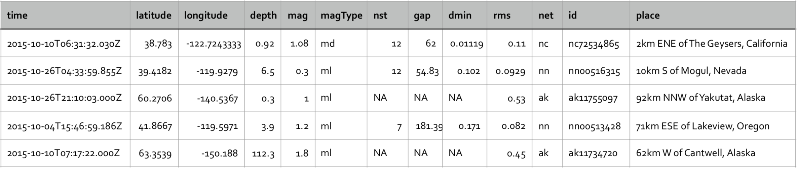

# earthquakes

<h3>Aim:</h3>
The goal of this data visualisation is to use of computer-supported, visual representations of data to amplify cognition. 

The process for developing a visualisation, has seven stages from acquiring data to interacting with it according to Ben(2008). 

<h3>The Data:</h3>
The data is from the <a href="https://earthquake.usgs.gov/earthquakes/" target="_blank">US Geological Survey websites</a> about active earthquakes around the world. The data is available in a variety of formats. The example of a partial extract from the CSV formatted version is:

Then parsing the relevant parts of each record to present the data in a visual form. For example, the parsing process requires to read each line as a String, split this String into pieces and convert each piece to the correct type of value. Then using these values to present the data in an appropriate way. 
<h4>Working with CSV Data in Processing</h4>
A CSV file is a text file in which certain characters must be interpreted as delimiters. There are two structures in a CSV file, a record, which is a line of text and a field which is a part of a record. A record is an individual line from the CSV file and a field is a part of the line. To identify fields in a record a special character (a comma) is used. 

To convert a CSV file to a usable internal format must convert records in the CSV file to a data structure. A class is defined to represent the record. 

The first step is to read in the CSV file. As the CSV file is a text file and each record is a line of text, the Processing function loadStrings() can be used. Next the required fields from each line need to be parsed and extracted. The fields extracted must be parsed to convert them from text to the required data type (e.g. latitude and longitude should be numbers). Once the required fields are extracted and parsed the values can be used to construct an object to represent the record.

<h3>Design:</h3>
The earthquake data contains geographic references so a good visualisation would start with mapping the location of the earthquakes onto a map of the world. 

Using a geo-graphic (equi-rectangular) projection of the earth, which allows to map longitude and latitude to Cartesian co-ordinates without needing a complex transform function as the map projection already has accounted for the distortion introduced when going from a spherical to a flat surface (i.e. we distort the map not the transform). 